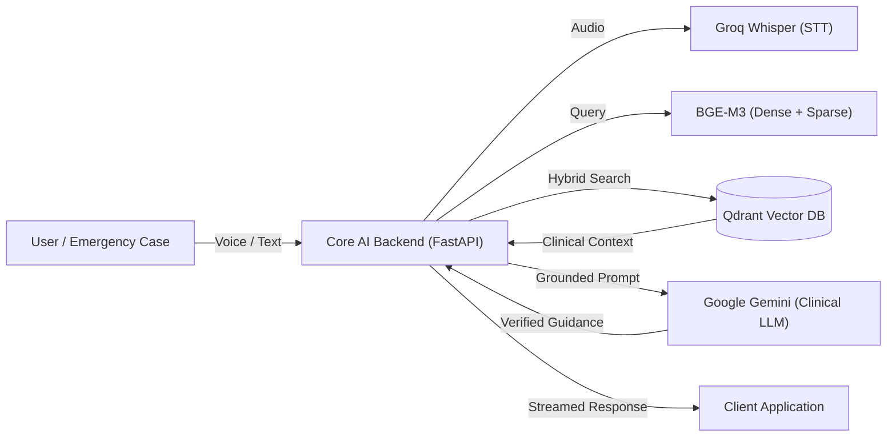

# Clinical AI Assistant


An intelligent, emergency-ready Clinical Decision Support System designed to deliver fast, verified, and strictly bounded first aid guidance in both **English** and **Arabic**.

The system is centered around an **AI-driven Hybrid RAG pipeline**—combining dense and sparse vector retrieval with reciprocal rank fusion (RRF) to ground every response in verified medical protocols while eliminating hallucinations. The platform is wrapped in a production-ready microservices architecture supporting real-time voice inputs, geolocation hospital discovery, and authenticated session management.

---

## AI Architecture & Pipeline



---

## System Architecture Overview

The system is built as a modular microservices architecture, prioritizing the AI core while integrating necessary services for a complete end-to-end product:

### 1. Core Clinical AI Service (`backend/ai/`) — *The AI Engine*
A production-ready FastAPI service following Clean Architecture principles:
- **Hybrid RAG Retrieval**: Coordinates dense and sparse vector searches in Qdrant, fusing rankings with Reciprocal Rank Fusion (RRF) for high-recall clinical retrieval.
- **Clinical Synthesis & Guardrails**: Enforces strict medical boundaries, detects locale (Arabic/English), and synthesizes safe first aid instructions via Google Gemini without hallucinating unsupported treatments.
- **Speech-to-Text Pipeline**: Processes emergency voice queries asynchronously using the Groq Whisper API.

### 2. Remote AI Inference Worker (Google Colab / GPU)
A dedicated GPU microservice handling compute-intensive AI operations:
- High-performance embedding generation using **BGE-M3** (dense embeddings and sparse lexical weights).
- Document parsing and structured chunking of medical PDFs via Docling.

### 3. Emergency Map Service (`backend/map/`)
An independent FastAPI microservice providing location-based search and routing for the 3 nearest emergency hospitals and healthcare facilities.

### 4. Auth & Session Backend (`backend/auth/`)
Node.js/Express service backed by MongoDB that manages user accounts, HttpOnly JWT cookies, and persistent conversation history across multiple chat sessions.

### 5. Frontend Client (`frontend/`)
A responsive web application built with React, TypeScript, Vite, Tailwind CSS, and shadcn/ui, providing voice recording, chat consultations, and map views.

---

## Key Features

- **Hybrid RAG Retrieval**: Combines semantic embeddings with lexical token matching and Reciprocal Rank Fusion (RRF) for strict, reliable clinical evidence retrieval.
- **Clinical Safety & Guardrails**: Hardened prompt templates with refusal gates that decline answering unsupported or out-of-scope non-medical questions.
- **Bilingual Medical Support**: Native comprehension and response generation for medical emergencies in both **Arabic** and **English**.
- **Voice-First Input**: Real-time audio transcription via Groq Whisper for quick hands-free interaction during urgent situations.
- **Emergency Facility Locator**: Geolocation lookup to instantly find and navigate to the nearest hospitals.
- **Multi-Session History & Guest Mode**: Authenticated users can store and manage past emergency consultations, while guests can use the system instantly without barriers.

---

## Prerequisites & Required API Keys

1. **Docker Desktop**: Required to run the full microservices stack.
2. **Active API Credentials**:
   - **Google Gemini API Key** (for clinical LLM generation).
   - **Groq API Key** (for Whisper speech-to-text).
3. **Remote GPU Microservice**: Required for BGE-M3 embedding generation and document ingestion.

---

## Required Pre-run Step: Colab Microservice

The embedding generation (BGE-M3 dense and sparse) and PDF layout parsing/chunking run on an external GPU microservice.

1. Open and run all cells in the Google Colab notebook:
   [Colab Microservice Notebook](https://colab.research.google.com/drive/1deZ1D9VzyDvB2_xQ_Lq7152VD9TcWq0T?usp=sharing)
2. Copy the generated public URL (e.g., your ngrok tunnel URL) and use it as `EMBEDDING_URL`.

---

## Environment Configuration

### 1. Root Environment (Frontend & Docker Compose)
```bash
cp .env.example .env
```

### 2. AI Backend Environment
```bash
cd backend/ai
cp .env.example .env
```

Edit `backend/ai/.env` and set your credentials:
```env
GEMINI_API_KEY=your_gemini_api_key_here
GROQ_API_KEY=your_groq_api_key_here
EMBEDDING_URL=https://your-colab-ngrok-url.ngrok-free.app
QDRANT_URL=http://qdrant:6333
```

---

## Running the Application

From the repository root, start all services via Docker Compose:

```bash
docker compose up --build
```

Services will be active at:

- **Frontend UI**: http://localhost:8080
- **FastAPI Core AI Backend**: http://localhost:3000
- **Core AI API Documentation**: http://localhost:3000/docs
- **FastAPI Map Backend**: http://localhost:5000
- **Map Service API Documentation**: http://localhost:5000/docs
- **Auth Node Backend**: http://localhost:4000
- **Qdrant Vector Store**: http://localhost:6333
- **MongoDB**: mongodb://localhost:27017

---

## Running Tests

### Core AI Backend (Automated Test Suite)
Run the full test suite for the AI service using `uv`:

```bash
cd backend/ai
uv run pytest tests/unit tests/integration/test_api_routes.py -v
```

### Map Service
Run the unit test suite for the emergency hospital locator:

```bash
cd backend/map
pytest tests/unit -v
```
