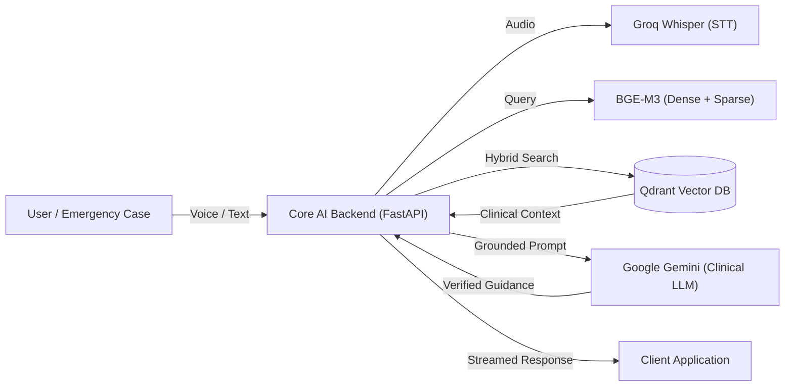
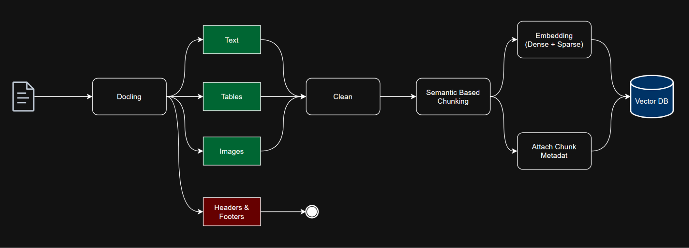
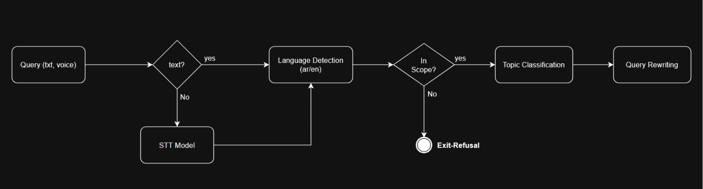
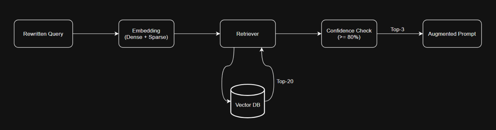
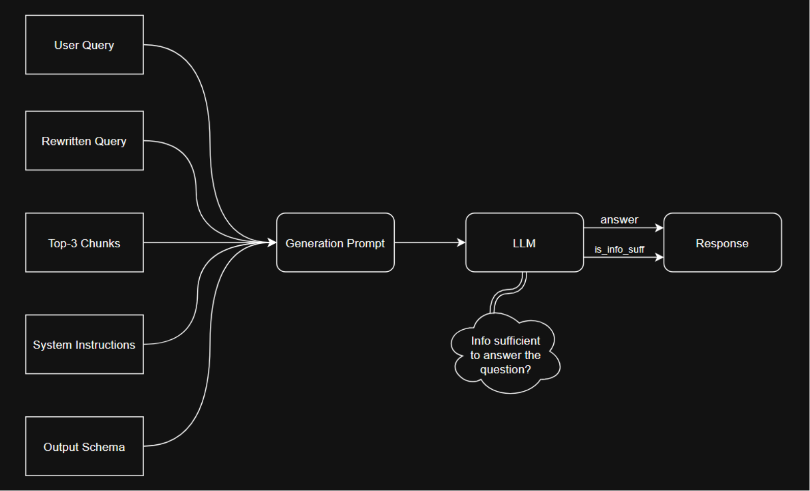

# First-Aid AI Assistant


An emergency-ready Clinical Decision Support System that delivers fast, verified first aid guidance in **English** and **Arabic**. Built on a **Hybrid RAG pipeline** that combines dense and sparse vector retrieval with Reciprocal Rank Fusion (RRF), grounding every response in verified medical protocols and refusing out-of-scope queries at the gate.

---

## Table of Contents

- [System Architecture](#system-architecture)
  - [High-Level Overview](#high-level-overview)
  - [Microservices Breakdown](#microservices-breakdown)
  - [AI Subsystem Pipelines](#ai-subsystem-pipelines)
- [Prerequisites](#prerequisites--required-api-keys)
- [Required Pre-run Step: Colab Microservice](#required-pre-run-step-colab-microservice)
- [Environment Configuration](#environment-configuration)
- [Running the Application](#running-the-application)
- [Running Tests](#running-tests)

---

## System Architecture

### High-Level Overview



---

### Microservices Breakdown

The platform is deployed as a set of independent, loosely-coupled microservices:

| Service | Stack | Responsibility |
|---|---|---|
| **Core AI Backend** (`backend/ai/`) | Python, FastAPI | Hybrid RAG orchestration, clinical guardrails, STT pipeline |
| **Remote Inference Worker** | Google Colab / GPU | BGE-M3 embedding generation, PDF parsing & chunking via Docling |
| **Emergency Map Service** (`backend/map/`) | Python, FastAPI | Geolocation-based search for the 3 nearest emergency facilities |
| **Auth & Session Backend** (`backend/auth/`) | Node.js, Express, MongoDB | JWT authentication, HttpOnly cookies, conversation history |
| **Frontend Client** (`frontend/`) | React, TypeScript, Vite, Tailwind, shadcn/ui | Voice recording, chat UI, interactive map views |

---

### AI Subsystem Pipelines

The core AI engine is composed of four modular pipelines that govern the full lifecycle from document ingestion to clinical answer generation.

---

#### 1. Document Ingestion & Chunking Pipeline

<p align="center">
  
</p>

- **Docling Extraction**: Parses medical reference PDFs, extracting text, tables, and images while discarding non-informative headers and footers.
- **Cleaning & Normalization**: Standardizes clinical narrative and tabular data for downstream processing.
- **Semantic-Based Chunking**: Splits protocols into coherent, context-preserving chunks that maintain clinical meaning across boundaries.
- **Dual Embedding & Metadata**: Each chunk is encoded into **BGE-M3** dense and sparse vectors, and tagged with source, topic, and page metadata.
- **Qdrant Ingestion**: Vectors and payloads are persisted in Qdrant, ready for hybrid retrieval.

---

#### 2. Query Handling & Preprocessing Pipeline

<p align="center">
  
</p>

- **Multi-Modal Input**: Accepts both text and voice queries.
- **Speech-to-Text**: Voice inputs are transcribed asynchronously via Groq Whisper before entering the pipeline.
- **Language Detection**: Identifies Arabic (`ar`) or English (`en`) to enforce locale-aware medical terminology downstream.
- **Scope Gate — Exit Refusal**: Out-of-scope or non-medical queries are refused here, before any retrieval or generation occurs.
- **Topic Classification**: Labels the emergency scenario (e.g., Burns, Bleeding, Fractures, Choking, CPR, Poisoning).
- **Query Rewriting**: Reformulates noisy user input into a clinically precise retrieval query.

---

#### 3. Hybrid Retriever Pipeline

<p align="center">
  
</p>

- **Dual Query Embedding**: The rewritten query is encoded into dense semantic and sparse lexical vectors using BGE-M3.
- **Hybrid Retrieval with RRF**: Dense and sparse searches run in parallel against Qdrant. Results are merged using Reciprocal Rank Fusion (RRF), yielding a ranked **Top-20** candidate set.
- **Confidence Filtering (>= 80%)**: Candidates below the confidence threshold are discarded, retaining only strongly correlated clinical evidence.
- **Top-3 Context Selection**: The three highest-scoring chunks are forwarded to the generation stage as grounded context.

---

#### 4. Clinical Answer Generation Pipeline

<p align="center">
  
</p>

- **Prompt Assembly**: Five inputs are fused into a single generation prompt:
  1. Original User Query
  2. Rewritten Query
  3. Top-3 Grounded Clinical Chunks
  4. System Instructions (safety guardrails & bilingual directives)
  5. Pydantic-defined Output Schema
- **LLM Sufficiency Check**: Google Gemini evaluates whether the retrieved context is sufficient to answer the query safely before generating a response.
- **Structured Output**: Returns a validated response object containing the clinical guidance (`answer`) and a sufficiency flag (`is_info_suff`).

---

## Prerequisites & Required API Keys

1. **Docker Desktop** — required to run the full microservices stack.
2. **API Credentials**:
   - **Google Gemini API Key** — clinical LLM generation.
   - **Groq API Key** — Whisper speech-to-text.
3. **Remote GPU Microservice** — required for BGE-M3 embedding and document ingestion (see below).

---

## Required Pre-run Step: Colab Microservice

Embedding generation and PDF parsing run on an external GPU microservice. Before starting the stack:

1. Open and run all cells in the Colab notebook:
   [Colab Microservice Notebook](https://colab.research.google.com/drive/1deZ1D9VzyDvB2_xQ_Lq7152VD9TcWq0T?usp=sharing)
2. Copy the generated public URL (e.g., your ngrok tunnel) and use it as `EMBEDDING_URL` in the next step.

---

## Environment Configuration

### Root (Frontend & Docker Compose)
```bash
cp .env.example .env
```

### AI Backend
```bash
cd backend/ai
cp .env.example .env
```

Edit `backend/ai/.env`:
```env
GEMINI_API_KEY=your_gemini_api_key_here
GROQ_API_KEY=your_groq_api_key_here
EMBEDDING_URL=https://your-colab-ngrok-url.ngrok-free.app
QDRANT_URL=http://qdrant:6333
```

---

## Running the Application

From the repository root:

```bash
docker compose up --build
```

| Service | URL |
|---|---|
| Frontend UI | http://localhost:8080 |
| Core AI Backend | http://localhost:3000 |
| Core AI API Docs | http://localhost:3000/docs |
| Map Backend | http://localhost:5000 |
| Map API Docs | http://localhost:5000/docs |
| Auth Backend | http://localhost:4000 |
| Qdrant Vector Store | http://localhost:6333 |
| MongoDB | mongodb://localhost:27017 |

---

## Running Tests

### Core AI Backend
```bash
cd backend/ai
uv run pytest tests/unit tests/integration/test_api_routes.py -v
```

### Map Service
```bash
cd backend/map
pytest tests/unit -v
```
